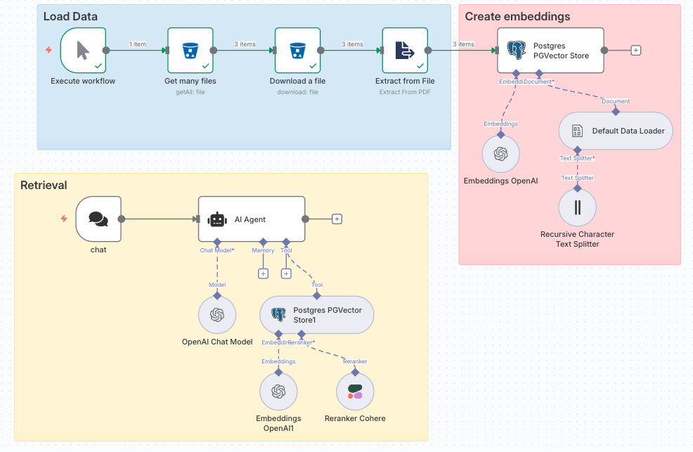
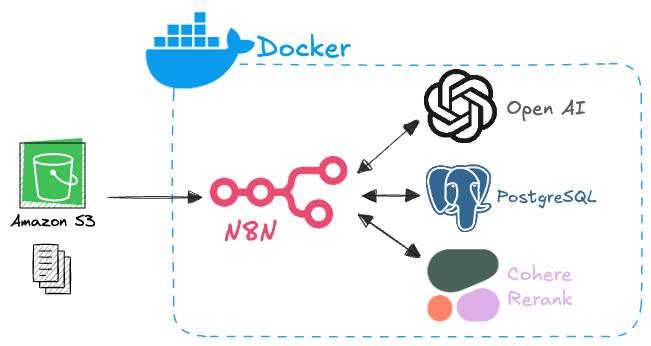

# n8n RAG - Sistema de Consulta Inteligente para Circulares do BACEN

Um sistema de RAG (Retrieval-Augmented Generation) construído com n8n para consultar circulares do Banco Central do Brasil usando processamento de linguagem natural e busca vetorial.

## 📋 Visão Geral

Este projeto implementa um sistema completo de RAG que:
- Carrega documentos PDF de circulares do BACEN do Amazon S3
- Processa e fragmenta os documentos automaticamente
- Cria embeddings usando OpenAI
- Armazena os vetores no PostgreSQL com extensão pgvector



## 🏗️ Arquitetura

O sistema é composto por dois workflows principais:

### 1. Pipeline de Carregamento de Dados
- **Get many files**: Lista arquivos do bucket S3
- **Download a file**: Baixa PDFs das circulares
- **Extract from File**: Extrai texto dos PDFs
- **Text Splitter**: Fragmenta o texto em chunks
- **Embeddings**: Gera embeddings usando OpenAI
- **Vector Store**: Armazena no PostgreSQL com pgvector

### 2. Sistema de Recuperação
- **Chat Interface**: Chat para interações (nativo)
- **AI Agent**: Agente com GPT-4
- **Vector Search**: Busca semântica nos documentos
- **Reranker**: Melhora a relevância dos resultados usando Cohere

## 🚀 Tecnologias Utilizadas

- **n8n**: Orquestração de workflows
- **PostgreSQL + pgvector**: Banco de dados vetorial
- **OpenAI GPT-4**: Modelo de linguagem para chat
- **OpenAI Embeddings**: Geração de embeddings
- **Amazon S3**: Armazenamento de documentos
- **Cohere Reranker**: Reordenação de resultados
- **Docker**: Containerização



## 📦 Instalação e Configuração

### Pré-requisitos

- Docker e Docker Compose
- Contas configuradas para:
  - OpenAI (API Key)
  - Amazon S3 (Access Key)
  - Cohere (API Key)

### 1. Clone o repositório

```bash
git clone https://github.com/lucasfelicio/n8n-rag.git
cd n8n-rag
```

### 2. Configure as variáveis de ambiente

```bash
cd docker/config
cp .env.example .env
```

Edite o arquivo `.env` com suas credenciais:

```bash
# Postgres
POSTGRES_USER=seu_usuario
POSTGRES_PASSWORD=sua_senha
POSTGRES_DB=seu_banco

# Database target usado pelo n8n
N8N_DB=n8n_rag

# n8n secrets (use chaves seguras em produção)
N8N_ENCRYPTION_KEY=sua_chave_de_encriptacao
N8N_USER_MANAGEMENT_JWT_SECRET=seu_jwt_secret
```

### 3. Execute o sistema

```bash
cd docker
docker-compose up -d
```

### 4. Configure as credenciais no n8n

1. Acesse `http://localhost:5678`
2. Configure as seguintes credenciais:
   - **OpenAI API**: Sua chave da API OpenAI
   - **Amazon S3**: Access Key e Secret Key
   - **Cohere API**: Sua chave da API Cohere
   - **PostgreSQL**: Credenciais do banco configurado

### 5. Importe o workflow

1. No n8n, importe o arquivo `src/n8n-rag.json`
2. Configure o bucket S3 com o nome correto
3. Ative o workflow

## 🎯 Como Usar

### Carregamento de Dados

1. Execute o workflow de carregamento manual
2. O sistema irá:
   - Listar todos os PDFs do bucket S3
   - Processar cada documento
   - Criar embeddings e armazenar no banco

### Consultas via Chat

1. Acesse a interface de chat disponibilizada pelo n8n
2. Faça perguntas sobre as circulares do BACEN
3. O sistema irá:
   - Buscar documentos relevantes
   - Usar o reranker para melhorar os resultados
   - Gerar uma resposta contextualizada

### Exemplos de Consultas

```
"Quais são as regras para provisões de crédito?"
"Como funciona o sistema de pagamentos instantâneos?"
"Quais são os requisitos de capital para bancos?"
```

## 🔧 Configuração Avançada

### Parâmetros de Text Splitting

- **Chunk Size**: 1000 caracteres (padrão)
- **Chunk Overlap**: 100 caracteres
- Ajuste conforme necessário no node "Recursive Character Text Splitter"

### Parâmetros de Busca

- **Top K**: 20 resultados iniciais
- **Reranker**: Ativo para melhorar relevância
- Configurável no node "Postgres PGVector Store1"

### Sistema Message do AI Agent

```
Use o Postgres PGVector Store1 para responder as perguntas do usuario sobre circulares do banco central do brasil (bacen). Essa é a sua base de conhecimento.
```

## 📝 Licença

Este projeto está sob a licença MIT. Veja o arquivo `LICENSE` para mais detalhes.

*© 2025 Lucas Felício / Winkller IT.*
